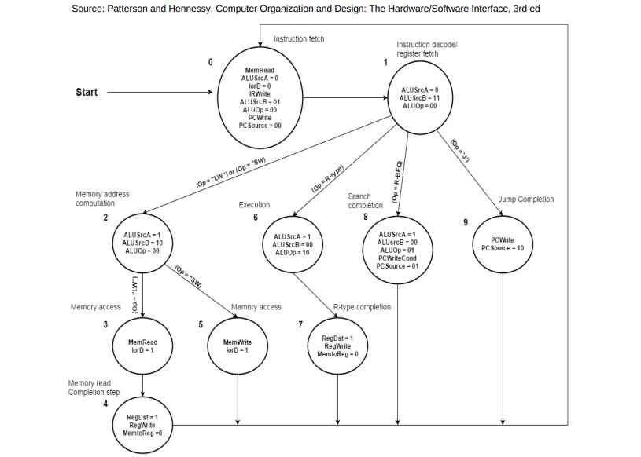

# MIPS RTL

Using an Intel MAX10 FPGA, I implemented the architecture for the single MIPS processor shown below:

The MIPS RTL is written in VHDL and synthesized with the Intel Quartus software. MIPS is a RISC instruction set, so load and use instructions are always separated. All testbench simulations were done using ModelSim Altera. (See test cases)

## Datapath

- **ALU:** Performs all the necessary arithmetic/logic/shift operations required to implement the MIPS instruction set (see instruction set table at the end of this document). The encoding of the R-type instructions first to simplify the logic.
- **Register File:** 32 registers with two read ports and one write port.
- **IR:** The Instruction Register (IR) holds the instruction once it is fetched from memory.
- **PC:** The Program Counter (PC) is a 32-bit register that contains the memory address of the next instruction to be executed.
- Some special-purpose registers, including Data Memory Register, RegA, RegB, ALUout, HI, and LO.
- **Memory:** Contains the RAM and memory-mapped I/O ports.

  - **RAM:** Consists of 256 32-bit words, mapped to address 0, and is initialized with a MIF file that contains the program that will execute. Use the 1-Port RAM component in the Quartus IP Catalog. The RAM uses word-aligned addresses, so you will need to remove the lower two bits of the 32-bit address when connecting to the RAM. In other words, for a 256-word RAM, the RAM address input would connect to (9 downto 2) of the 32-bit address. We are not implementing load/store byte instructions, but if we did, you would use the lower two bits to select which of the 4 bytes of the 32-bit word to use.
- **ALU Control Unit:** Some logic to determine the select code for ALU Operations. As described in the lecture, this ALU Control Unit uses signals from both the Main Controller and the datapath.
- **Sign Extended:** Converts a signed 16-bit input to its 32-bit representation when the signal “isSigned” is asserted.

## Controller Algorithm

CPU Controllers are defined by an Algorithmic State Machine (ASM). I used an existing controller algorithm from "Computer Organization and Design: The Hardware/Software Interface, 3rd ed." From the algorithm, I translated it into an ASM that fits the specific MIPS architecture that I implemented. Many adjacent steps in this algorithm needed an intermediate state in the ASM when signals were registered (delayed by a clock cycle) more than once.

## CPU

The CPU implements the datapath, controller, and logic gates that are used for branch and jump instructions. Once the CPU design is synthesized, you can program the MAX10 FPGA or simulate the design using ModelSim.

MIPS Reference: [Link to MIPS Reference](https://www.cs.unibo.it/~solmi/teaching/arch_2002-2003/AssemblyLanguageProgDoc.pdf)
